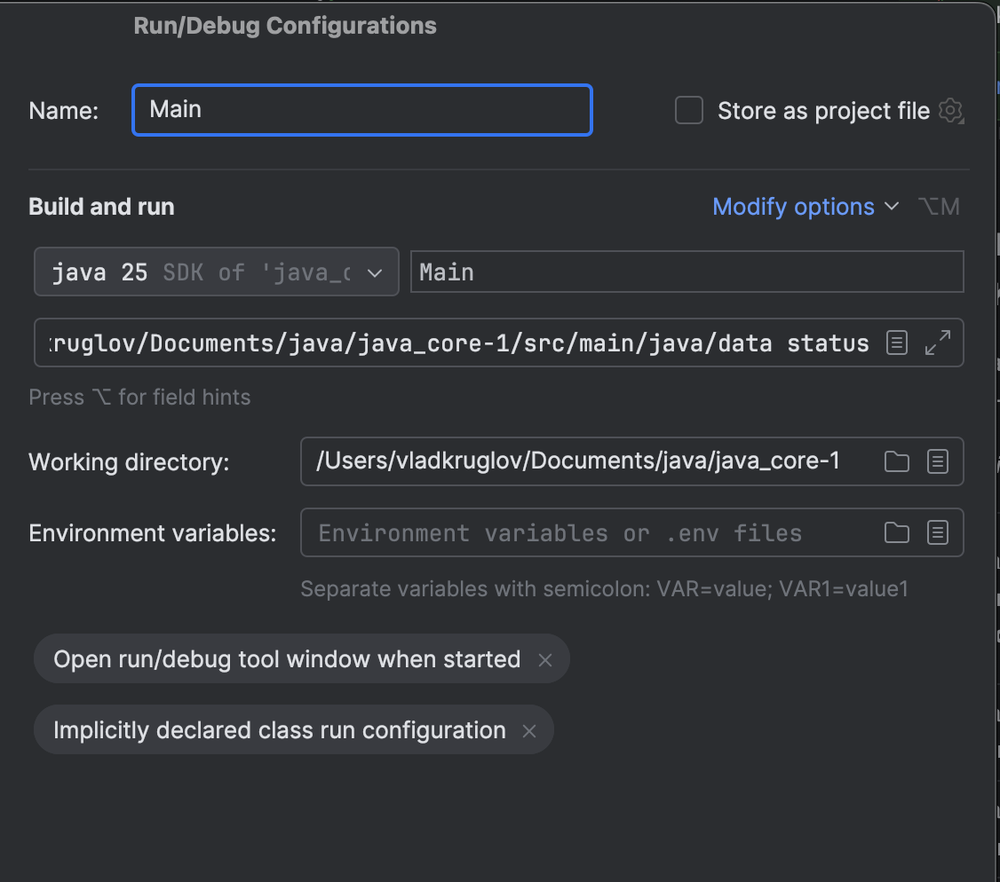

# 📊 Java Core: Генератор Статистики з JSON-файлів

Цей консольний застосунок розроблено для паралельної обробки JSON-даних з кількох файлів, формування статистики за вказаним атрибутом та експорту результату у відсортований XML-файл.

**Ключові архітектурні рішення:**
* **Багатопоточність:** Використовується `ExecutorService` для обробки файлів паралельно.
* **Пам'ять:** Реалізовано **стрімінговий парсинг (Jackson Streaming API)** для уникнення завантаження великих файлів у оперативну пам'ять.
* **Типова безпека:** Атрибути визначені за допомогою `enum` (**`StatisticsAttribute`**).
* **Агрегація:** Використовується **`ConcurrentHashMap`** для потокобезпечного збору статистики.

---

## 1. 📚 Опис Основних Сутностей

Для прикладу, ми обрали предметну область **Замовлення-Кліент**.

| Сутність       | Роль | Приклади Атрибутів                                                                           | Відношення                                  |
|:---------------| :--- |:---------------------------------------------------------------------------------------------|:--------------------------------------------|
| **Замовлення** | Основна | `order_id`, `client_id`, `client_name`, `order_date`, `total_amount`, `status`, `categories` | Багато Замовлень належать до Одного Кліента |
| **Кліент**     | Другорядна | (Поле `client_name` у Замовленні)                                                            |                                             |

### Атрибути для Статистики (Enum: `StatisticsAttribute`)

| Атрибут       | JSON Ключ     | Складність | Опис                                                                          |
|:--------------|:--------------| :--- |:------------------------------------------------------------------------------|
| `CLIENT_NAME` | `client_name` | Простий | Підрахунок замовлень у кліента.                                               |
| `ORDER_DATE`  | `order_date`  | Простий | Підрахунок замовлень за роком публікації.                                     |
| `STATUS`  | `STATUS`  | Простий | Підрахунок замовлень за статусом.                                             |
| `CATEGORIES`       | `CATEGORIES`      | **Складний** | Вимагає розбиття рядка (наприклад, `"Electronic, Sport"`) на окремі елементи. |

---

## 2. 📄 Приклади Вхідних та Вихідних Файлів

### А. Приклад Вхідного JSON-файлу (`data-1.json`)

```json
[
  {
    "order_id": "ORD-1001",
    "client_id": "C001",
    "client_name": "Іван Петренко",
    "order_date": "2025-03-12",
    "total_amount": 2499.5,
    "status": "completed",
    "categories": "Електроніка, Аксесуари"
  }
]
```

### Б. Приклад Вихідного XML-файлу (`statistics_by_status.xml`)

Файл генерується в ту ж папку, що містить вхідні JSON-файли.

```xml
<?xml version="1.0" encoding="UTF-8"?>
<statistics>
    <item>
        <value>completed</value>
        <count>1</count>
    </item>
</statistics>
```

## 3. 🚀 Інструкція по Запуску та Архітектура

### A. Схема Паралельної Обробки
Програма використовує `ExecutorService` для паралельної обробки вхідних файлів.  
Кожен файл обробляється окремим потоком, який записує результат у потокобезпечний агрегатор.

### B. Збірка Maven
Переконайтеся, що встановлено **Java 25** (тому що локально запускався на 25 версії) та **Maven**.  
Виконайте команду для збірки "товстого" JAR:

```bash
   mvn clean package
```

### B. Виконання (Запуск скрипта)

Запуск програми вимагає двох параметрів: шлях до папки з даними та ім'я атрибута у **ВЕРХНЬОМУ** регістрі (відповідно до enum).

1. Відкриваемо вкладку Run/Debug Configurations та тиснемо  Add New Configuration
2. Робимо налаштування як на скріншоті Name можемо вказати який завгодно 

## 4. 📈 Результати Експериментів з Кількістю Потоків

Для оцінки ефективності **паралельної обробки** були проведені вимірювання часу виконання на тестовому наборі даних.

*(Замініть значення у таблиці після проведення тестування)*

| Кількість Потоків (`threadCount`) | Час Виконання (мс) | Коефіцієнт Прискорення (відносно 1 потоку) |
| :---: |:------------------:|:------------------------------------------:|
| **1** |       142мс        |              1.00x (Базовий)               |
| **2** |       149мс        |                   0.95х                    |
| **4** |       108мс        |                   1.31x                    |
| **8** |       110мс        |                   1.29x                    |